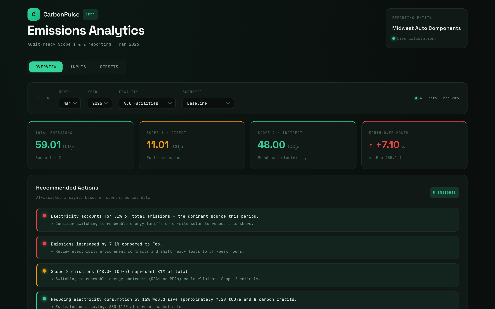
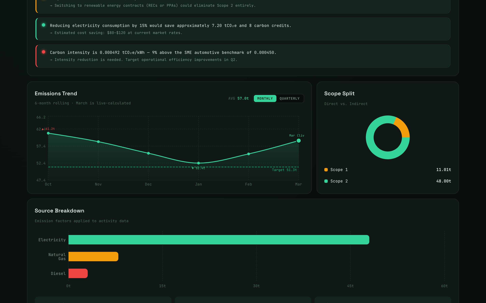
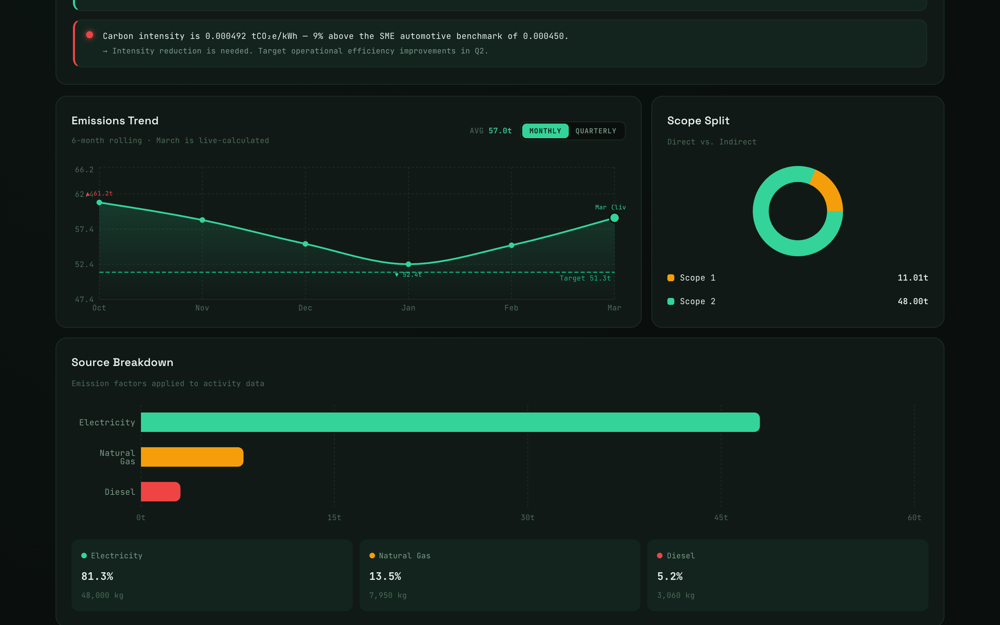
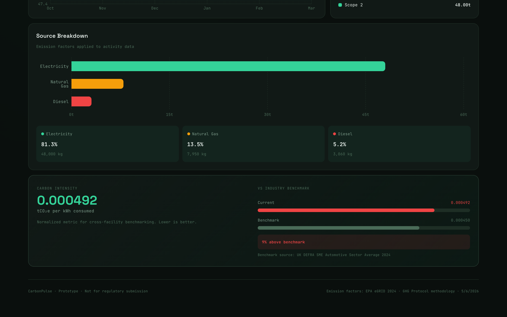
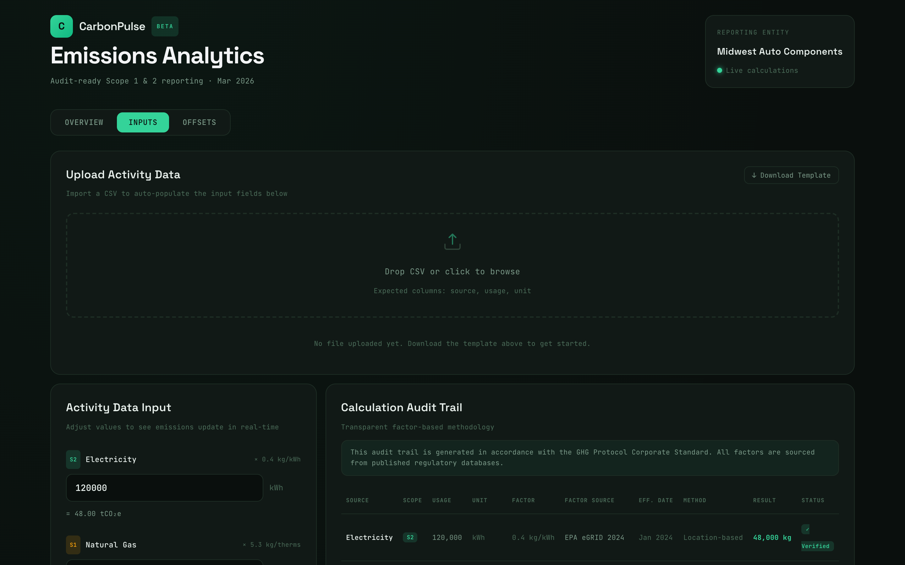
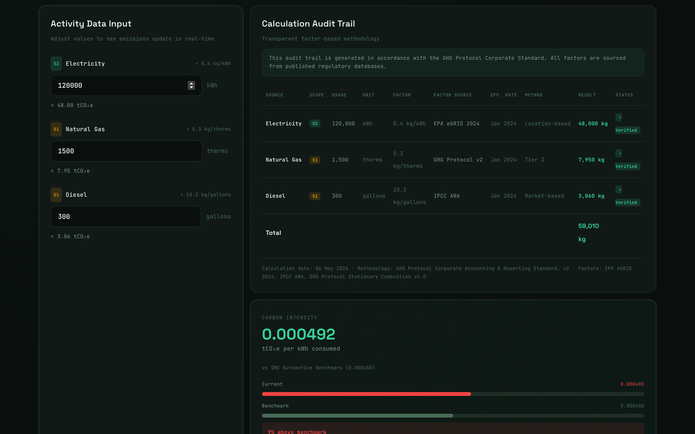
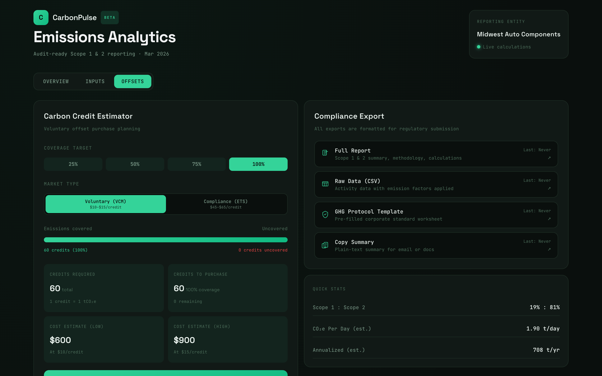
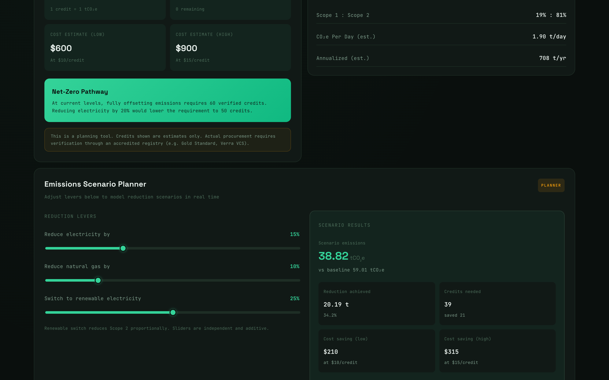
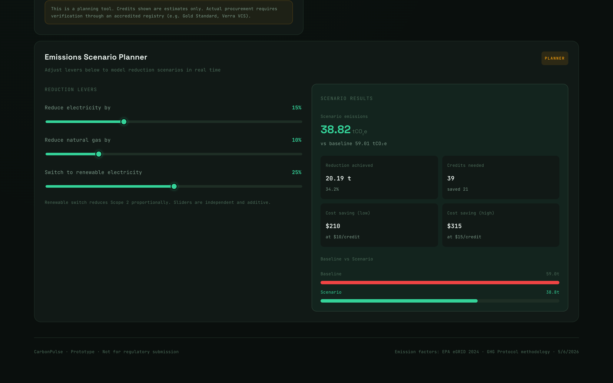

<div align="center">

# ⚡ CarbonPulse

### Scope 1 & 2 Emissions Analytics for Manufacturing SMEs

*Turn your utility bills into audit-ready carbon reports — in minutes, not months.*

---


<br/>



</div>

---

## The Problem We Solve

Small and medium-sized automotive parts manufacturers are under growing pressure from OEM customers — Ford, GM, Stellantis — to disclose their carbon emissions. The data already exists: electricity bills, gas invoices, fuel records. What's missing is a system that transforms raw operational data into the standardized, traceable, audit-ready emissions reports that supply chain audits now demand.

Enterprise platforms like Persefoni cost tens of thousands of dollars and require dedicated ESG teams. Spreadsheets break under scrutiny. **CarbonPulse fills the gap** — a focused, affordable platform built specifically for the operations manager who just received a supplier sustainability questionnaire and has 48 hours to respond.

---

## What It Does

```
Upload CSV / Enter Data  →  Calculate Emissions  →  Dashboard Insights  →  Export Report
```

CarbonPulse takes your electricity (kWh), natural gas (therms), and diesel (gallons) data and:

- Calculates **Scope 1 & Scope 2 emissions** using EPA eGRID 2024 + GHG Protocol v2 factors
- Visualizes your **monthly trend, source breakdown, and carbon intensity** on a live dashboard
- Generates an **AI-assisted insights panel** with quantified, actionable recommendations
- Runs **scenario simulations** so you can model the impact of energy reduction initiatives
- Estimates your **carbon credit needs and costs** across VCM and ETS markets
- Exports a **PDF compliance report, CSV dataset, GHG Protocol template, or clipboard summary** in one click

---

## Screenshots

<details>
<summary><strong>📊 Overview Dashboard</strong></summary>
<br/>


*KPI cards showing total emissions, Scope 1 / Scope 2 breakdown, and month-over-month change*


*12-month emissions trend with min/max annotations and 90% reduction target line*


*Scope 1 vs Scope 2 breakdown by energy source — pie charts and bar chart*

</details>

<details>
<summary><strong>🤖 AI-Assisted Insights</strong></summary>
<br/>


*5 colour-coded recommendations ranked by impact, with quantified savings estimates*

</details>

<details>
<summary><strong>📥 Data Input & Audit Trail</strong></summary>
<br/>


*Manual data entry — real-time recalculation as you type*


*Full calculation audit trail: raw inputs → emission factors → tCO₂e outputs*

</details>

<details>
<summary><strong>🎛️ Scenario Planner & Carbon Credits</strong></summary>
<br/>


*Interactive sliders: model electricity reduction, gas reduction, and renewable switching*


*VCM vs ETS market toggle with coverage selector and cost range estimator*

</details>

<details>
<summary><strong>📤 Export</strong></summary>
<br/>


*One-click exports: PDF report, CSV data, GHG Protocol template, or clipboard*

</details>

---

## Quick Start

```bash
# 1. Clone
git clone https://github.com/Omjagtapp/carbonpulse.git
cd carbonpulse

# 2. Install
npm install

# 3. Run
npm run dev
```

Open **http://localhost:5173** — that's it. No backend, no database, no accounts.

> **Want to test with real-looking data?**
> Drag `sample-data-valid.csv` onto the upload zone in the Inputs tab.
> The dashboard will populate instantly.

---

## CSV Format

Upload your monthly energy data with this structure:

| month | electricity_kwh | natural_gas_therms | diesel_gallons |
|-------|-----------------|--------------------|----------------|
| Jan   | 45000           | 820                | 340            |
| Feb   | 42000           | 890                | 310            |

- Column names are **case-insensitive** (`Electricity_KWH` works fine)
- Units are **normalized automatically** — `kWh`, `KWH`, `kwh` all accepted
- Invalid or missing rows are **flagged inline** before any calculation runs
- See [`sample-data-valid.csv`](sample-data-valid.csv) and [`sample-data-invalid.csv`](sample-data-invalid.csv) for reference

---

## Emission Factors

| Source       | Scope | Factor                 | Standard        |
|--------------|-------|------------------------|-----------------|
| Electricity  | 2     | 0.4 kg CO₂e / kWh     | EPA eGRID 2024  |
| Natural Gas  | 1     | 5.3 kg CO₂e / therm   | GHG Protocol v2 |
| Diesel       | 1     | 10.2 kg CO₂e / gallon | IPCC AR6        |

All calculations follow the **GHG Protocol Corporate Accounting and Reporting Standard**. The full audit trail is visible inside the app on every calculation.

---

## Tech Stack

| Layer     | Technology                           |
|-----------|--------------------------------------|
| Framework | React 19 + Vite 8                    |
| Charts    | Recharts 3                           |
| PDF Export| jsPDF 4 + jspdf-autotable            |
| Styling   | Inline CSS with custom design tokens |
| Linting   | ESLint 9 with React Hooks rules      |

No backend. No database. No auth. Pure client-side — deploy anywhere static files run.

---

## Architecture

```
src/
├── App.jsx                  # Stateful hub — owns all state, renders tabs
├── main.jsx                 # React entry point
├── index.css                # Global styles + CSS variables
│
├── components/
│   ├── OverviewTab.jsx      # KPI cards, trend chart, intensity benchmark
│   ├── InputsTab.jsx        # Manual entry form + audit trail
│   ├── OffsetsTab.jsx       # Credits estimator, exports
│   ├── CSVUpload.jsx        # Drag-drop parser with row-level validation
│   ├── FilterBar.jsx        # Month / year / facility / scenario selectors
│   ├── InsightsPanel.jsx    # 5-item AI recommendation list
│   ├── ScenarioTool.jsx     # Slider-based reduction modeler
│   └── AuditTrail.jsx       # Transparent calculation table
│
├── data/
│   └── mockData.js          # Emission factors, historical data, benchmarks
│
└── utils/
    ├── calculations.js      # Core math: emissions, intensity, insights
    └── exports.js           # PDF / CSV / GHG Protocol / clipboard generation
```

**Design principle:** `App.jsx` is the single source of truth. All child components are stateless and presentational. State flows down as props; events bubble up as callbacks. Adding a new data source means touching `calculations.js` and `mockData.js` only.

---

## Roadmap

The current MVP is fully client-side with mock data. Here's what comes next:

- [ ] **Backend API** — Express / FastAPI + PostgreSQL for persistent multi-user data
- [ ] **Authentication** — Company onboarding, user roles (Admin / Viewer)
- [ ] **Multi-facility support** — Consolidated reporting across plants
- [ ] **Scope 3 tracking** — Upstream supply chain emissions (Tier 1 module)
- [ ] **Live utility integrations** — Auto-ingest from utility APIs, no more CSV uploads
- [ ] **Regulatory templates** — CDP, TCFD, GRI-compatible export formats
- [ ] **Benchmarking** — Industry-level comparisons against anonymized peer data

---

## Sample Data

| File | Description |
|------|-------------|
| [`sample-data.csv`](sample-data.csv) | 12 months of realistic energy data for a mid-size facility |
| [`sample-data-valid.csv`](sample-data-valid.csv) | Clean data — all rows pass validation |
| [`sample-data-invalid.csv`](sample-data-invalid.csv) | Intentionally malformed — great for testing the validator |

---

## Team

Built by **Group 4** as part of IDS 494/594 — University of Illinois Chicago.

| Name     | Role                                        |
|----------|---------------------------------------------|
| Om       | Full-stack development, product architecture |
| Khuzaima | Business strategy, market validation         |
| Anish    | System design, UML architecture              |
| Ujjwal   | Research, industry outreach                  |

---

## License

MIT — do whatever you want with it. If you build something cool on top of this, let us know.

---

<div align="center">

*Built for the manufacturers who keep the supply chain moving —*
*and now need to prove they're doing it responsibly.*

**⚡ CarbonPulse**

</div>
